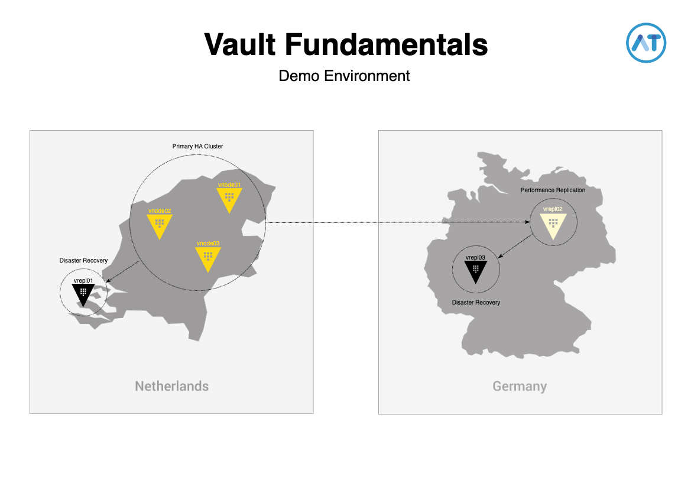

# Vault Fundamentals

This repository is to deploy a demo environment on AWS for the Vault Fundamentals training / workshop.  
  
Needless to say, you will need a valid AWS account.  
Please make sure you have your AWS credentials set as environment variables.  
See [this document](https://docs.aws.amazon.com/sdk-for-php/v3/developer-guide/guide_credentials_environment.html) for more instructions on how to do that.
  
To use the entire demo environment, **a valid Vault Enterprise license key is needed** since this demo includes Enterprise features.

If you don't have a Vault Enterprise license, you can specify the `vault_binary_name` variable with the value `vault` (the default is `vault-enterprise`) in the `terraform.tfvars` file.  
Note that if you use the open source version of Vault, you cannot perform the Replication part of this demo.

The following resources will be deployed in AWS:

- 1 SSH key-pair
- 1 KMS key for auto-unseal
- 1 Security Group with the following rules:
  - Ingress: tcp/8200, tcp/8201 and tcp/22 IPv4 and IPv6.
  - Egress: Everything IPv4 and IPv6.
- 3 EC2 instances for an HA vault cluster (hostname `vnode##`)
- 3 EC2 instances for replication purposes (hostname `vrepl##`)

Please note that

- All Vault instances will be provisioned with Vault Enterprise, including a config file, Enterprise license and a .env file containing AWS credentials.
- All Vault instances will be in an uninitialized and sealed state.
- All Vault services will have to be started manually.
- The EC2 instances for the 3-node Vault cluster will be provisioned with a specific tag to leverage the auto_join capabilities and is included in the config file.

---

## Schematic overview



---

## Pre-requisites

**Follow the steps below.**

### Clone

Perform the following command to clone the repository to local disk.

```bash
git clone https://github.com/chrisvanmeer/vault-fundamentals.git
cd vault-fundamentals
```

**If you don't have all of this information, the deployment will fail.**

### File creation

Perform the following command to create new user-defined files.

```bash
for i in *.example; do cp -a $i ${i%%.example}; done
```

### `terraform.tfvars`

Please fill in the following data:

- AWS Account ID
- AWS IAM user

This data will be used for the KMS inline key-policy that will act as our auto-unseal key.

### `vault.env`

Please fill in the following data:

- AWS Access Key ID
- AWS Secret Access Key

This file will be used by the Vault instances to leverage the auto-unseal mechanism.

### `vault.hclic`

Please paste your Vault Enterprise license string into this file when using the Vault Enterprise binary.

---

## Deploy infrastructure

```bash
terraform init && terraform apply
```

After that you will be presented with a list of names and IP addresses of the provisioned instances.  
If you want, you can use a pre-configured `tmux` startup file to connect to all the nodes.

```bash
bash vault-tmux.sh
```

`tmux` will be started with the following configuration:

```text
┌───────────────────────┬────────────────────────┐  ┌────────────────────────┬───────────────────────┐  ┌────────────────────────┬───────────────────────┐
│ vnode01                 vrepl01                │  │ vnode02                │ vnode03               │  │ vrepl02                │ vrepl03               │
│                       │                        │  │                        │                       │  │                        │                       │
│                                                │  │                        │                       │  │                        │                       │
│                       │                        │  │                        │                       │  │                        │                       │
│                                                │  │                        │                       │  │                        │                       │
│                       │                        │  │                        │                       │  │                        │                       │
│                                                │  │               synchronized-panes               │  │                        │                       │
│                       │                        │  │                        │                       │  │                        │                       │
│                                                │  │                        │                       │  │                        │                       │
│                       │                        │  │                        │                       │  │                        │                       │
│                                                │  │                        │                       │  │                        │                       │
│                       │                        │  │                        │                       │  │                        │                       │
│                                                │  │                        │                       │  │                        │                       │
└───────────────────────┴────────────────────────┘  └────────────────────────┴───────────────────────┘  └────────────────────────┴───────────────────────┘
          Window 0: active / replication                          Window 1: standby nodes                          Window 2: replication nodes
       vnode01 will be full screen at start
```

---

## Demo guidelines

Here are some code snippets that will help you guide the demo environment for the following purposes

### Part I - Building a fault tolerant Vault setup

#### HA

1. On `vnode01`, perform the following:

   ```bash
   sudo service vault start && vault operator init -recovery-shares=1 -recovery-threshold=1 | tee vault.creds
   ```

   This will start up the Vault service and create a single recovery key that will be written to a local file.  
   **This is just for demo purposes, always use the default shares or higher in production environments.**  
   Wait a few seconds afterwards.

   ```bash
   cat vault_creds | awk '/Initial Root Token:/ { print $4 }' | vault login -
   echo "Recovery Key for vnodes 2 and 3 is: " `awk '/Recovery Key 1/ { print $4 }' vault.creds`
   ```

   This will log you into Vault with the initial root token and display the recovery key that will be needed by `vnode02` and `vnode03`.

2. On `vnode02` and `vnode03`, perform the following

   ```bash
   sudo service vault start
   vault operator unseal <recovery key from vnode01>
    ```

    Since these nodes are part of a raft-cluster, after starting the Vault service they will connect to the Active node (`vnode01`) but for security you will need to provide the recovery key created in step 1 to prove that this node is actually meant to be added to the cluster in stead of a rogue / malicious node.

3. On `vnode01`, perform the following:

     ```bash
     vault operator raft list-peers
     ```

     This will list all of the raft peers connected to the cluster. You will see that `vnode01` is the Active node, also called a leader node.  
     Now we will force a new leader election by stepping down as leader on `vnode01`.

     ```bash
     vault operator step-down
     vault operator raft list-peers
     ```

     After stepping down, there is a new leader election and you will see that another node will assume the role of the Active node.

---

#### Replication

##### Pre-requisite policy

1. On `vnode01`, perform the following:

     ```bash
     vault policy write admin-policy -<<EOF
     path "*" {
       capabilities = ["create","read","update","delete","list","sudo]
     }
     EOF
     ```

     This will create a general admin policy.  
     **Do not use such a policy in a production environment, use the least privilege model**

     ```bash
     vault auth enable userpass
     vault write auth/userpass/users/admin policies=admin-policy password=vault
     ```

---

##### Disaster recovery ( Netherlands )

1. On `vnode01`, perform the following:

     ```bash
     vault read sys/replication/dr/status
     vault write -f sys/replication/dr/primary/enable
     vault read sys/replication/dr/status
     vault write -f sys/replication/dr/primary/secondary-token id=repl01
     ```

2. On `vrepl01`, perform the following:

     ```bash
     sudo service vault start && vault operator init -recovery-shares=1 -recovery-threshold=1 | tee vault.creds
     ```

     Wait a few seconds.

     ```bash
     awk '/Initial Root Token:/ { print $4 }' | vault login -
     vault read sys/replication/dr/status

     export SECONDARY_TOKEN=<token from vnode01>
     vault write -f sys/replication/dr/secondary/enable token=$SECONDARY_TOKEN
     vault read sys/replication/dr/status
     ```

---

##### Performance replication ( Germany )

1. On `vnode01`, perform the following:

     ```bash
     vault read sys/replication/performance/status
     vault write -f sys/replication/performance/primary/enable
     vault read sys/replication/performance/status
     vault write -f sys/replication/performance/primary/secondary-token id=repl02
     ```

2. On `vrepl02`, perform the following:

     ```bash
     sudo service vault start && vault operator init -recovery-shares=1 -recovery-threshold=1 | tee vault.creds
     ```

     Wait a few seconds.

     ```bash
     cat vault.creds | awk '/Initial Root Token:/ { print $4 }' | vault login -
     vault read sys/replication/performance/status

     export SECONDARY_TOKEN=<token from vnode01>
     vault write -f sys/replication/performance/secondary/enable token=$SECONDARY_TOKEN
     vault read sys/replication/performance/status
     ```

---

##### Disaster recovery - from Performance secondary ( Germany )

1. On `vrepl02`, perform the following:

     ```bash
     vault read sys/replication/dr/status
     vault write -f sys/replication/dr/primary/enable
     vault read sys/replication/dr/status
     vault write -f sys/replication/dr/primary/secondary-token id=repl03
     ```

2. On `vrepl03`, perform the following:

     ```bash
     sudo service vault start && vault operator init -recovery-shares=1 -recovery-threshold=1 | tee vault.creds
     ```

     Wait a few seconds.

     ```bash
     cat vault.creds | awk '/Initial Root Token:/ { print $4 }' | vault login -
     vault read sys/replication/dr/status

     export SECONDARY_TOKEN=<token from vrepl02>
     vault write -f sys/replication/dr/secondary/enable token=$SECONDARY_TOKEN
     vault read sys/replication/dr/status
     ```

---

### Part II - Using the AppRole method to retrieve secrets

For the subsequent parts of this demo, we will populate our newly created HA cluster with another policy, the approle auth methods and a secret.  
All these steps should be performed on `vnode01`.

1. First, lets create some data that we will store in a secret.

     ```bash
     cat > payload.json -<<EOF
     {
       "list": [
         "Ad Thiers",
         "Chris Tevel",
         "Chris van Meer",
         "Danny Kip",
         "Dennis Kruyt",
         "Gerlof Langeveld",
         "Koert Gielen",
         "Marcel Kornegoor",
         "Michael Trip",
         "Rens Sikma",
         "Richard Schutte",
         "Stefan Joosten",
         "Sven Kappers",
         "Ton Kersten",
         "Vincent Lamers",
         "Winfried de Heiden - Voorwinde"
       ]
     }
     EOF
     ```

---

2. Next, we will enable a (versioned) k/v secrets engine and generate a secret with the data created in step 1.

     ```bash
     vault secrets enable -version=2 kv
     vault kv put kv/consultants @payload.json
     ```

3. Since the web application will need some sort of machine-oriented way to authenticate, we will enable the AppRole auth method and create a new role that will use a policy which we will create in the next step.

     ```bash
     vault auth enable approle
     vault write -f auth/approle/role/consultants policies=consultants-policy
     ```

4. Now we will write the policy for the role created in step 3 that allows access to the consultants secret created in step 1.

     ```bash
     vault policy write consultants-policy -<<EOF
     path "kv/data/consultants" {
       capabilities = ["read"]
     }
     EOF
     ```

---

5. The only thing left to do on the cluster is to get all the relevant data for the web application.

     First, read and note the Role ID.

     ```bash
     vault read auth/approle/role/consultants/role-id
     ```

     Next, read and note the Secret ID.

     ```bash
     vault write -f auth/approle/role/consultants/secret-id
     ```

     And last, read and note the IP address of the Active node.

     ```bash
     vault operator raft list-peers | awk '/leader/ {print $2}' | sed 's/.$/0/'
     ```

6. Visit <https://hashilab.nl/vault>, go to the settings (wrench icon) and fill in the data retrieved at step 5.
7. Use the back arrow button to go to the main page and see if there are any results.

---

## Destroy infrastructure

```bash
terraform destroy
```

Note that when you destroy the environment, the KMS key will not be deleted immediately, but it will be scheduled for deletion in the next 7 days.
