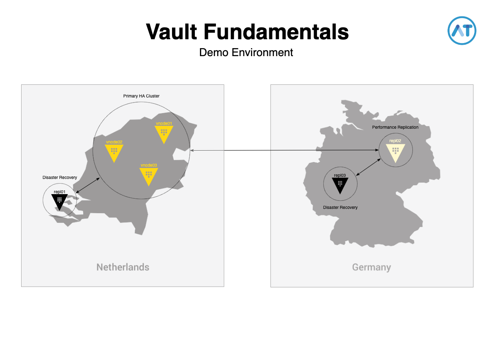

# Vault Fundamentals

This repository is to deploy a demo environment for the Vault Fundamentals training / workshop.  
For this demo environment, you will **need a valid Vault Enterprise license key** for this to work.  
The following resources will be deployed in AWS:

- 1 SSH key-pair
- 1 KMS key for auto-unseal
- 3 EC2 instances for an HA vault cluster (hostname vnode##)
- 3 EC2 instances for replication purposes (hostname vrepl##)

Please note that

- All Vault instances will be provisioned with Vault Enterprise, including a config file, NFR license and a .env file containing AWS credentials.
- All Vault instances will be in an uninitialized and sealed state.
- All Vault services will have to be started manually.
- The EC2 instances for the 3-node Vault cluster will be provisioned with a specific tag to leverage the auto_join capabilities and is included in the config file.

## Schematic overview



## Pre-requisites

**Follow the steps below.**

### Clone

Perform the following command to clone the repository to local disk.

```bash
git clone https://github.com/chrisvanmeer/vault-fundamentals.git
cd vault-fundamentals
```

**If you don't have all of this information, the deployment will fail.**

### File creation

Perform the following command to create new user-defined files.

```bash
for i in *.example; do cp -a $i ${i%%.example}; done
```

### `terraform.tfvars`

Please fill in the following data

- AWS Account ID
- AWS IAM user

### `vault.env`

Please fill in the following data

- AWS Access Key ID
- AWS Secret Access Key

### `vault.hclic`

Please paste your Vault Enterprise license string into this file.

## Deploy infrastructure

```bash
terraform init && terraform apply
```

After that you will be presented with a list of names and IP addresses of the provisioned instances.  
If you want, you can use a pre-configured `tmux` startup file to connect to all the nodes.

```bash
bash vault-tmux.sh
```

`tmux` will be started with the following configuration:

```text
┌────────────────────────────────────────────────┐  ┌────────────────────────┬───────────────────────┐  ┌────────────────────────┬───────────────────────┐
│ vnode01                                        │  │ vnode02                │ vnode03               │  │ vrepl02                │ vrepl03               │
│                                                │  │                        │                       │  │                        │                       │
│                                                │  │                        │                       │  │                        │                       │
│                                                │  │                        │                       │  │                        │                       │
│                                                │  │                        │                       │  │                        │                       │
│                                                │  │                        │                       │  │                        │                       │
│                                                │  │               synchronized-panes               │  │                        │                       │
│                                                │  │                        │                       │  │                        │                       │
│                                                │  │                        │                       │  │                        │                       │
│                                                │  │                        │                       │  │                        │                       │
│                                                │  │                        │                       │  │                        │                       │
│                                                │  │                        │                       │  │                        │                       │
│                                                │  │                        │                       │  │                        │                       │
└────────────────────────────────────────────────┘  └────────────────────────┴───────────────────────┘  └────────────────────────┴───────────────────────┘
                 Window 0: active                                    Window 1: standby                                Window 2: replication
```

## Demo guidelines

Here are some code snippets that will help you guide the demo environment for the following purposes

### HA

1. On `vnode01`, perform the following:

   ```bash
   sudo service vault start && vault operator init -recovery-shares=1 -recovery-threshold=1 | tee vault.creds | awk '/Initial Root Token:/ { print $4 }' | vault login -
   echo "Recovery Key for vnodes 2 and 3 is: " `awk '/Recovery Key 1/ { print $4 }' vault.creds`
   ```

2. On `vnode02` and `vnode03`, perform the following

   ```bash
   sudo service vault start
   vault operator unseal
    ```

3. On `vnode01`, perform the following:

     ```bash
     vault operator raft list-peers
     vault operator step-down
     vault operator raft list-peers
     ```

### Populate

1. On `vnode01`, perform the following:

     ```bash
     vault policy write consultants-policy -<<EOF
     path "kv/data/consultants" {
       capabilities = ["read"]
     }
     EOF
     ```

     ```bash
     cat > payload.json -<<EOF
     {
       "list": [
         "Ad Thiers",
         "Chris Tevel",
         "Chris van Meer",
         "Danny Kip",
         "Dennis Kruyt",
         "Gerlof Langeveld",
         "Koert Gielen",
         "Marcel Kornegoor",
         "Michael Trip",
         "Rens Sikma",
         "Richard Schutte",
         "Stefan Joosten",
         "Sven Kappers",
         "Ton Kersten",
         "Vincent Lamers",
         "Winfried de Heiden - Voorwinde"
       ]
     }
     EOF
     ```

     ```bash
     vault auth enable userpass
     vault write auth/userpass/users/`whoami` policies=consultants-policy password=vault
     vault secrets enable -version=2 kv
     vault kv put kv/consultants @payload.json
     ```

### Replication

#### Disaster recovery ( Netherlands )

1. On `vnode01`, perform the following:

     ```bash
     vault read sys/replication/dr/status
     vault write -f sys/replication/dr/primary/enable
     vault read sys/replication/dr/status
     vault write -f sys/replication/dr/primary/secondary-token id=dr-repl01
     ```

2. On `vault-fundamentals-repl-01`, perform the following:

     ```bash
     sudo service vault start && vault operator init -recovery-shares=1 -recovery-threshold=1 | tee vault.creds | awk '/Initial Root Token:/ { print $4 }' | vault login -
     vault read sys/replication/dr/status
     vault write -f sys/replication/dr/secondary/enable token=<token from `vnode01`>
     vault read sys/replication/dr/status
     ```

#### Performance replication ( Germany )

1. On `vnode01`, perform the following:

     ```bash
     vault read sys/replication/performance/status
     vault write -f sys/replication/performance/primary/enable
     vault read sys/replication/performance/status
     vault write -f sys/replication/performance/primary/secondary-token id=pr-repl02
     ```

2. On `vault-fundamentals-repl-02`, perform the following:

     ```bash
     sudo service vault start && vault operator init -recovery-shares=1 -recovery-threshold=1 | tee vault.creds | awk '/Initial Root Token:/ { print $4 }' | vault login -
     vault read sys/replication/performance/status
     vault write -f sys/replication/performance/secondary/enable token=<token from `vnode01`>
     vault read sys/replication/performance/status
     ```

#### Disaster recovery - from Performance secondary ( Germany )

1. On `vault-fundamentals-repl-02`, perform the following:

     ```bash
     vault read sys/replication/dr/status
     vault write -f sys/replication/dr/primary/enable
     vault read sys/replication/dr/status
     vault write -f sys/replication/dr/primary/secondary-token id=dr-repl03
     ```

2. On `vault-fundamentals-repl-03`, perform the following:

     ```bash
     sudo service vault start && vault operator init -recovery-shares=1 -recovery-threshold=1 | tee vault.creds | awk '/Initial Root Token:/ { print $4 }' | vault login -
     vault read sys/replication/dr/status
     vault write -f sys/replication/dr/secondary/enable token=<token from `vnode01`>
     vault read sys/replication/dr/status
     ```

## Destroy infrastructure

```bash
terraform destroy
```

Note that when you destroy the environment, the KMS key will not be deleted immediately, but it will be scheduled for deletion in the next 7 days.
